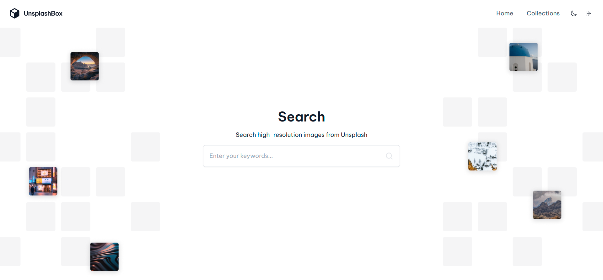

# Unsplash Box

This project is a full-stack application that allows users to search, view, and manage collections of images from Unsplash. The app provides features similar to Unsplash's own collection functionality, with additional capabilities for authenticated users to curate and store their own collections.



## Features

- **Homepage**

  - Search for images from Unsplash using keywords.
  - Display a list of images based on search queries.
  - Infinite scrolling for seamless image browsing.
  - Masonry layout for an aesthetic display of images.

- **Image Details Page**

  - View details of selected images, including author and published date.
  - See which collections the image belongs to.
  - Add images to collections or remove them.
  - Download images.

- **Collections Page**

  - Create new collections.
  - View and manage existing collections.
  - Select a collection to view its images.

- **User Authentication**

  - Sign up and log in using email/password or Google.
  - Store user-specific collections in Firestore.

- **UI/UX Enhancements**
  - Theme switcher for light and dark modes.
  - Responsive design for a seamless experience across devices.

## Technologies Used

- **Front-end**: React, React Router, React Query, Tailwind CSS
- **Back-end**: Firebase Authentication, Firestore
- **API**: Unsplash API
- **Other**: Theme Switcher, Infinite Scrolling, Masonry Layout

## Installation

1. **Clone the repository**:

```bash
git clone https://github.com/ibrahim11elian/unsplash-box.git
```

2. **Navigate to the project directory**:

```bash
cd unsplash-box
```

3. **Install dependencies**:

```bash
npm install
```

4. **Set up Firebase**:
   - Create a Firebase project in the [Firebase Console](https://console.firebase.google.com/).
   - Enable Authentication with Email/Password and Google.
   - Create a Firestore database.
   - Add the Firebase config to your project.
     Create `.env` file at the root folder and add this values

```.env
VITE_UNSPLASH_ACCESS_KEY=
VITE_UNSPLASH_SECRET_KEY=
VITE_FIREBASE_API_KEY=
VITE_FIREBASE_AUTH_DOMAIN=
VITE_FIREBASE_PROJECT_ID=
VITE_FIREBASE_STORAGE_BUCKET=
VITE_FIREBASE_MESSAGING_SENDER_ID=
VITE_FIREBASE_APP_ID=
VITE_FIREBASE_MEASUREMENT_ID=

```

5. **Run the app**:

```bash
npm run dev
```

## Usage

- **Searching for Images**: Use the search bar on the homepage to find images by keywords. Press "Enter" to display the results.
- **Viewing Image Details**: Click on an image to view its details on a separate page.
- **Managing Collections**: From the Image Details page, add or remove images from collections. Use the Collections page to view and manage your collections.
- **Authentication**: Sign up or log in to save your collections. Users can authenticate using email/password or Google.

## Acknowledgements

- [Unsplash](https://unsplash.com/) for providing a rich collection of free images.
- [Firebase](https://firebase.google.com/) for backend services.
- [Tailwind CSS](https://tailwindcss.com/) for utility-first CSS framework.
- [React Query](https://react-query.tanstack.com/) for powerful data-fetching capabilities.

## Author

<p align="left">

<a href="https://www.linkedin.com/in/ibrahim-ahmed-a8bba9196" target="_blank">
</a>
<a href="https://www.facebook.com/ibrahim11ahmed" target="_blank">
</a>
<a href="mailto:ibrahim11elian@gmail.com" target="_blank">
</a>
<a href="tel:+201157676284" target="_blank">
</a>
<a href="https://www.instagram.com/ibrahim11ahmed/" target="_blank">
</a>
<a href="https://twitter.com/ibrahim11elian" target="_blank">
<a href="https://leetcode.com/ibrahim11elian" target="_blank">

</p>
